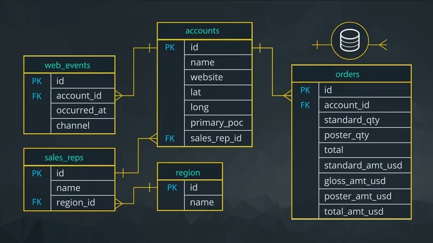
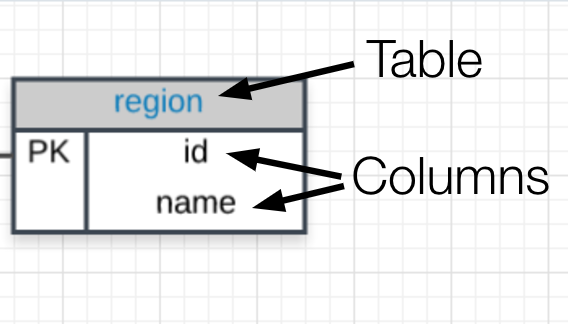
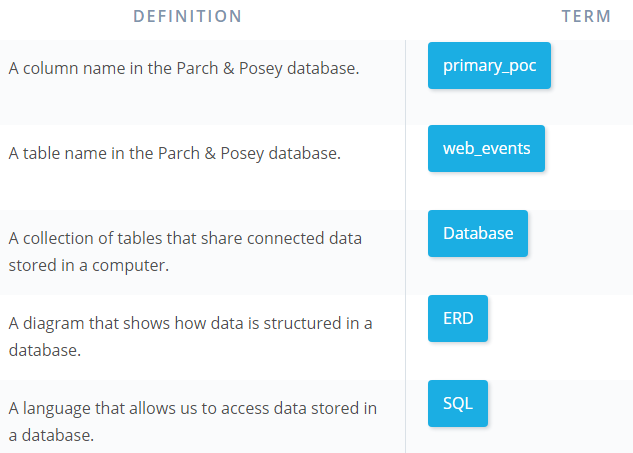
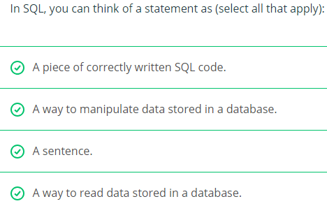
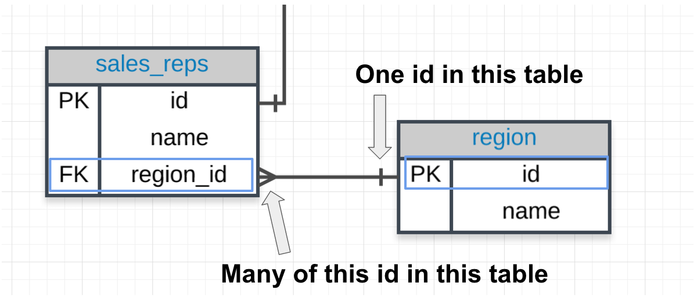
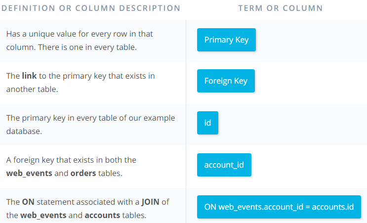
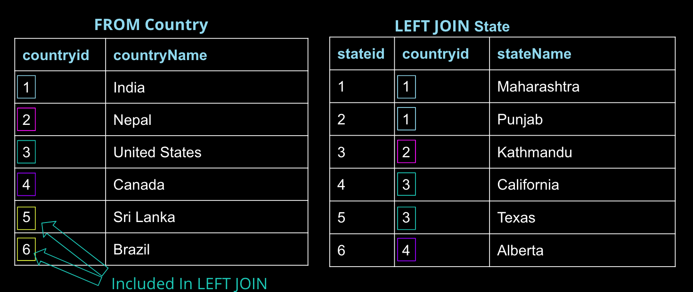

# SQL for Data Analysis

<!-- TOC -->

- [SQL for Data Analysis](#sql-for-data-analysis)
    - [Lesson 1: Basic SQL](#lesson-1-basic-sql)
        - [Entity Relationship Diagrams](#entity-relationship-diagrams)
        - [What to Notice](#what-to-notice)
        - [Quiz: ERD Fundamentals](#quiz-erd-fundamentals)
        - [Why Do Data Analysts Use SQL](#why-do-data-analysts-use-sql)
        - [Why Businesses Like Databases](#why-businesses-like-databases)
        - [How Databases Store Data](#how-databases-store-data)
        - [Types of Statements](#types-of-statements)
        - [Quiz: Statements](#quiz-statements)
        - [SELECT & FROM](#select--from)
        - [Formatting Best Practices](#formatting-best-practices)
        - [LIMIT](#limit)
        - [ORDER BY](#order-by)
        - [WHERE](#where)
        - [WHERE with Non-Numeric Data](#where-with-non-numeric-data)
        - [Arithmetic Operators](#arithmetic-operators)
        - [Introduction to Logical Operators](#introduction-to-logical-operators)
        - [LIKE](#like)
        - [IN](#in)
        - [NOT](#not)
        - [AND](#and)
        - [BETWEEN Operator](#between-operator)
        - [OR](#or)
        - [Recap Lesson 1](#recap-lesson-1)
    - [Lesson 2: SQL Joins](#lesson-2-sql-joins)
        - [Why Would We Want to Split Data Into Separate Tables](#why-would-we-want-to-split-data-into-separate-tables)
        - [ERD Reminder](#erd-reminder)
        - [Keys](#keys)
        - [Quiz: Primary - Foreign Key Relationship](#quiz-primary---foreign-key-relationship)
        - [Alias](#alias)
        - [Quiz: JOIN Questions Part I](#quiz-join-questions-part-i)
        - [JOIN Check In](#join-check-in)
        - [Quiz: LEFT and RIGHT JOIN](#quiz-left-and-right-join)
        - [JOINs and Filtering](#joins-and-filtering)
        - [Recap Lesson 2](#recap-lesson-2)
    - [Lesson 3: SQL Aggregations](#lesson-3-sql-aggregations)
        - [Introduction to Aggregation](#introduction-to-aggregation)
        - [NULLs](#nulls)
        - [COUNT](#count)
        - [SUM](#sum)
        - [MIN and MAX](#min-and-max)
        - [AVG](#avg)
        - [GROUP BY](#group-by)

<!-- /TOC -->

## Lesson 1: Basic SQL

### Entity Relationship Diagrams

An **entity relationship diagram (ERD)** is a common way to view data in a database. Below is the ERD for the database we will use from Parch & Posey. These diagrams help you visualize the data you are analyzing including:

1. The names of the tables.  
2. The columns in each table.
3. The way the tables work together.

**You can think of each of the boxes below as a spreadsheet.**  

  

### What to Notice

In the Parch & Posey database there are five tables (essentially 5 spreadsheets):

1. **web_events**
2. **accounts**
3. **orders**
4. **sales_reps**
5. **region**

You can think of each of these tables as an individual spreadsheet. Then the columns in each spreadsheet are listed below the table name. For example, the **region** table has two columns: `id` and `name`. Alternatively the **web_events** table has four columns.  

  

The `"crow's foot"` that connects the tables together shows us how the columns in one table relate to the columns in another table.

### Quiz: ERD Fundamentals

  

### Why Do Data Analysts Use SQL

There are some major advantages to using traditional relational databases, which we interact with using SQL. The five most apparent are:

- SQL is easy to understand.
- Traditional databases allow us to access data directly.
- Traditional databases allow us to audit and replicate our data.
- SQL is a great tool for analyzing multiple tables at once.
- SQL allows you to analyze more complex questions than dashboard tools like Google Analytics.

### Why Businesses Like Databases

1. **Data integrity is ensured** - only the data you want entered is entered, and only certain users are able to enter data into the database.
2. **Data can be accessed quickly** - SQL allows you to obtain results very quickly from the data stored in a database. Code can be optimized to quickly pull results.
3. **Data is easily shared** - multiple individuals can access data stored in a database, and the data is the same for all users allowing for consistent results for anyone with access to your database.

### How Databases Store Data

1. **Data in databases is stored in tables that can be thought of just like Excel spreadsheets.** For the most part, you can think of a database as a bunch of Excel spreadsheets. Each spreadsheet has rows and columns. Where each row holds data on a transaction, a person, a company, etc., while each column holds data pertaining to a particular aspect of one of the rows you care about like a name, location, a unique id, etc.
2. **All the data in the same column must match in terms of data type.** An entire column is considered quantitative, discrete, or as some sort of string. This means if you have one row with a string in a particular column, the entire column might change to a text data type. **This can be very bad if you want to do math with this column!**
3. **Consistent column types are one of the main reasons working with databases is fast.** Often databases hold **a LOT** of data. So, knowing that the columns are all of the same type of data means that obtaining data from a database can still be fast.  

### Types of Statements

The key to SQL is understanding **statements.** A few statements include:

1. **CREATE TABLE** is a statement that creates a new table in a database.
2. **DROP TABLE** is a statement that removes a table in a database.
3. **SELECT** allows you to read data and display it. This is called a **query.**

### Quiz: Statements

  

### SELECT & FROM

1. **SELECT** is where you tell the query what columns you want back.
2. **FROM** is where you tell the query what table you are querying from. Notice the columns need to exist in this table.

### Formatting Best Practices

- **Capitalization.** You may have noticed that we have been capitalizing SELECT and FROM, while we leave table and column names lowercase. This is a common formatting convention. It is common practice to capitalize commands (SELECT, FROM), and keep everything else in your query lowercase. This makes queries easier to read, which will matter more as you write more complex queries. For now, it is just a good habit to start getting into.
- **Avoid Spaces in Table and Variable Names.** It is common to use underscores and avoid spaces in column names. It is a bit annoying to work with spaces in SQL. In Postgres if you have spaces in column or table names, you need to refer to these columns/tables with double quotes around them (Ex: FROM "Table Name" as opposed to FROM table_name). In other environments, you might see this as square brackets instead (Ex: FROM [Table Name]).
- **Use White Space in Queries.** SQL queries ignore spaces, so you can add as many spaces and blank lines between code as you want, and the queries are the same. This query

```sql
SELECT account_id FROM orders
```

is equivalent to this query:

```sql
SELECT account_id
FROM orders
```

- **SQL isn't Case Sensitive.** The following query:

```sql
SELECT account_id
FROM orders
```

is the same as:

```sql
select account_id
from orders
```

However, I would again urge you to follow the conventions outlined earlier in terms of fully capitalizing the commands, while leaving other pieces of your code in lowercase.

- **Semicolons.** Depending on your SQL environment, your query may need a semicolon at the end to execute. Other environments are more flexible in terms of this being a "requirement." It is considered best practices to put a semicolon at the end of each statement, which also allows you to run multiple commands at once if your environment is able to show multiple results at once. Best practice:

```sql
SELECT account_id
FROM orders;
```

### LIMIT

We have already seen the **SELECT** (to choose columns) and **FROM** (to choose tables) statements. The **LIMIT** statement is useful when you want to see just the first few rows of a table. This can be much faster for loading than if we load the entire dataset.  
The **LIMIT** command is always the very last part of a query. An example of showing just the first 10 rows of the orders table with all of the columns might look like the following:

```sql
SELECT *
FROM orders
LIMIT 10;
```

We could also change the number of rows by changing the 10 to any other number of rows.

### ORDER BY

The **ORDER BY** statement allows us to order our table by any row. If you are familiar with Excel, this is similar to the sorting you can do with filters.  
The **ORDER BY** statement is always after the **SELECT** and **FROM** statements, but it is before the **LIMIT** statement. As you learn additional commands, the order of these statements will matter more. If we are using the **LIMIT** statement, it will always appear last.  
`Pro Tip`: Remember DESC can be added after the column in your **ORDER BY** statement to sort in descending order, as the default is to sort in ascending order.  
We can **ORDER BY** more than one column at a time. The statement sorts according to columns listed from left first and those listed on the right after that. We still have the ability to flip the way we order using DESC.

### WHERE

**WHERE** - allows you to filter a set of results based on specific criteria.  
Common symbols used within **WHERE** statements include:

1. \> (greater than)  
2. < (less than)  
3. \>= (greater than or equal to)  
4. <= (less than or equal to)  
5. = (equal to)  
6. != (not equal to)  

### WHERE with Non-Numeric Data

The **WHERE** statement can also be used with non-numerical data. We can use the `=` and `!=` operators here. You also need to be sure to use single quotes (just be careful if you have quotes in the original text) with the text data.  
Commonly when we are using **WHERE** with non-numeric data fields, we use the **LIKE**, **NOT**, or **IN** operators.  

### Arithmetic Operators

**Derived Columns.** Creating a new column that is a combination of existing columns is known as a **derived** column.  
Common operators include:

1. \* (Multiplication)
2. \+ (Addition)
3. \- (Subtraction)
4. / (Division)

**Order of Operations. (PEMDAS)** The following two statements have very different end results:  

1. Standard_qty / standard_qty + gloss_qty + poster_qty
2. standard_qty / (standard_qty + gloss_qty + poster_qty)

### Introduction to Logical Operators

**Logical Operators** include:

1. **LIKE.** This allows you to perform operations similar to using **WHERE** and `=`, but for cases when you might **not** know **exactly** what you are looking for.  
2. **IN.** This allows you to perform operations similar to using **WHERE** and `=`, but for more than one condition.
3. **NOT.** This is used with **IN** and **LIKE** to select all of the rows **NOT LIKE** or **NOT IN** a certain condition.
4. **AND & BETWEEN.** These allow you to combine operations where all combined conditions must be true.
5. **OR.** This allow you to combine operations where at least one of the combined conditions must be true.

### LIKE

The **LIKE** operator is extremely useful for working with text. You will use **LIKE** within a **WHERE** clause. The **LIKE** operator is frequently used with `%`. The `%` tells us that we might want any number of characters leading up to a particular set of characters or following a certain set of characters. Remember you will need to use single quotes for the text you pass to the **LIKE** operator, because of this lower and uppercase letters are not the same within the string. Searching for **'T'** is not the same as searching for **'t'.** In other SQL environments (outside the classroom), you can use either single or double quotes.

### IN

The **IN** operator allows you to filter data based on several possible values. The **IN** operator is useful for working with both numeric and text columns. This operator allows you to use an `=`, but for more than one item of that particular column. We can check one, two or many column values for which we want to pull data, but all within the same query.  
**Pro Tip:** "IN" requires single quotation marks around non-numerical data.  
**Pro Tip:** You have to put a `comma` in between each pair of distinct values.  
**Expert Tip.** In most SQL environments, you can use single or double quotation marks - and you may NEED to use double quotation marks if you have an apostrophe within the text you are attempting to pull. In the work spaces in the classroom, note you can include an apostrophe by putting two single quotes together. Example `Macy's` in our work space would be `'Macy"s'`.  

### NOT

Provides the inverse results for **IN**, **LIKE**, **AND** similar operators.  
The **NOT** operator is an extremely useful operator for working with the previous two operators we introduced: **IN** and **LIKE**. By specifying **NOT LIKE** or **NOT IN**, we can grab all of the rows that do not meet a particular criteria.

### AND

The **AND** operator is used within a **WHERE** statement to consider more than one logical clause at a time. Each time you link a new statement with an **AND**, you will need to specify the column you are interested in looking at. You may link as many statements as you would like to consider at the same time. This operator works with all of the operations we have seen so far including arithmetic operators (`+`, `*`, `-`, `/`). **LIKE, IN**, and **NOT** logic can also be linked together using the **AND** operator.  
**Pro Tip:** Filter based on multiple criteria using "AND".

### BETWEEN Operator

Sometimes we can make a cleaner statement using **BETWEEN** than we can using **AND**. Particularly this is true when we are using the same column for different parts of our **AND** statement.  
Instead of writing :

```sql
WHERE column >= 6 AND column <= 10
```

we can instead write, equivalently:

```sql
WHERE column BETWEEN 6 AND 10
```

### OR

Similar to the **AND** operator, the **OR** operator can combine multiple statements. Each time you link a new statement with an **OR**, you will need to specify the column you are interested in looking at. You may link as many statements as you would like to consider at the same time. This operator works with all of the operations we have seen so far including arithmetic operators (`+`, `*`, `-`, `/`), **LIKE, IN, NOT, AND,** and **BETWEEN** logic can all be linked together using the **OR** operator.  
When combining multiple of these operations, we frequently might need to use *parentheses* to assure that logic we want to perform is being executed correctly.  
**OR** can be combined with other operators by using parentheses.  

### Recap Lesson 1

Commands  

| Statement | How to Use It               | Other Details                                         |
| --------- | --------------------------- | ----------------------------------------------------- |
| SELECT    | SELECT Col1, Col2, ...      | Provide the columns you want                          |
| FROM      | FROM Table                  | Provide the table where the columns exist             |
| LIMIT     | LIMIT 10                    | Limits based number of rows returned                  |
| ORDER BY  | ORDER BY Col                | Orders table based on the column. Used with DESC.     |
| WHERE     | WHERE Col > 5               | A conditional statement to filter your results        |
| LIKE      | WHERE Col LIKE '%me%'       | Only pulls rows where column has 'me' within the text |
| IN        | WHERE Col IN ('Y', 'N')     | A filter for only rows with column of 'Y' or 'N'      |
| NOT       | WHERE Col NOT IN ('Y', 'N') | NOT is frequently used with LIKE and IN               |
| AND       | WHERE Col1 > 5 AND Col2 < 3 | Filter rows where two or more conditions must be true |
| OR        | WHERE Col1 > 5 OR Col2 < 3  | Filter rows where at least one condition must be true |
| BETWEEN   | WHERE Col BETWEEN 3 AND 5   | Often easier syntax than using an AND                 |  

Other Tips  
Though SQL is **not case sensitive** (it doesn't care if you write your statements as all uppercase or lowercase). **The order of the key words does matter!** Using what you know so far, you will want to write your statements as:

```sql
SELECT col1, col2
FROM table1
WHERE col3  > 5 AND col4 LIKE '%os%'
ORDER BY col5
LIMIT 10;
```

Notice, you can retrieve different columns than those being used in the **ORDER BY** and **WHERE** statements. Assuming all of these column names existed in this way (`col1`, `col2`, `col3`, `col4`, `col5`) within a table called `table1`, this query would run just fine.

## Lesson 2: SQL Joins

### Why Would We Want to Split Data Into Separate Tables

**Joins:**

1. Orders and accounts are different types of objects
2. This allows queries to execute more quickly

**Database Normalization.** When creating a database, it is really important to think about how data will be stored. This is known as **normalization**, and it is a huge part of most SQL classes. If you are in charge of setting up a new database, it is important to have a thorough understanding of database **normalization**.  
There are essentially three ideas that are aimed at database normalization:

1. Are the tables storing logical groupings of the data?  
2. Can I make changes in a single location, rather than in many tables for the same information?  
3. Can I access and manipulate data quickly and efficiently?

However, most analysts are working with a database that was already set up with the necessary properties in place. As analysts of data, you don't really need to think too much about data **normalization.** You just need to be able to pull the data from the database, so you can start drawing insights.  

The whole goal of **JOIN** statements is to allow us to pull from more than one table at a time.  
Again - **JOIN**s are useful for allowing us to pull data from multiple tables. This is both simple and powerful all at the same time.  
With the addition of the **JOIN** statement to our toolkit, we will also be adding the **ON** statement.  
**JOIN**s tells query an additional table from which you would like to pull data.  
**ON** specifies a logical statement to combine the table in from and **JOIN** statements  

### ERD Reminder

You might notice that the **PK** is associated with the first column in every table. The **PK** here stands for **primary key**. A primary key exists in every table, and it is a column that has a unique value for every row. `PK`, column is always **unique.** For this database it is always called `id`, but that is not true of all databases.  

### Keys

**Primary Key (PK).** A primary key is a **unique column** in a particular table. This is the first column in each of our tables. Here, those columns are all called `id`, but that doesn't necessarily have to be the name. **It is common that the primary key is the first column in our tables in most databases.**  
**Foreign Key (FK).** A foreign key is when we see a **primary key in another table**.  

  

**Primary - Foreign Key Link**  
In the above image you can see that:

1. The **region_id** is the foreign key.
2. The region_id is **linked** to id - this is the primary-foreign key link that connects these two tables.
3. The crow's foot shows that the **FK** can actually appear in many rows in the **sales_reps** table.
4. While the single line is telling us that the **PK** shows that id appears only once per row in this table.  

### Quiz: Primary - Foreign Key Relationship



**Select all that are true for primary keys.**  

1. There is one and only one of these columns in every table.  
2. They are a column in a table.

**Select all that are true of foreign keys.**

1. They are always linked to a primary key.
2. In the above database, every foreign key is associated with the crow-foot notation, which suggests it can appear multiple times in the column of a table.

### Alias

When we JOIN tables together, it is nice to give each table an **alias**. Frequently an alias is just the first letter of the table name. You actually saw something similar for column names in the **Arithmetic Operators** concept.

Example:

```sql
FROM tablename AS t1
JOIN tablename2 AS t2
```

Before, you saw something like:

```sql
SELECT col1 + col2 AS total, col3
```

Frequently, you might also see these statements **without the AS statement.** Each of the above could be written in the following way instead, and they would still produce the exact same results:

```sql
FROM tablename t1
JOIN tablename2 t2
```

and

```sql
SELECT col1 + col2 total, col3
```

While aliasing tables is the most common use case. It can also be used to alias the columns selected to have the resulting table reflect a more readable name.

Example:

```sql
SELECT t1.column1 aliasname, t2.column2 aliasname2
FROM tablename AS t1
JOIN tablename2 AS t2
```

### Quiz: JOIN Questions Part I

 1. The **ON** statement **should** always occur with the foreign key being equal to the primary key.
 2. **JOIN** statements allow us to pull data from multiple tables in a **SQL** database.
 3. You can use all of the commands we saw in the first lesson along with **JOIN** statements.
 4. Aliasing is common to shorten table names when we start **JOIN**ing multiple tables together.  

 `Expert Tip` You have had a bit of an introduction to these **one-to-one** and **one-to-many** relationships when we introduced **PKs** and **FKs.** Notice, traditional databases do not allow for **many-to-many** relationships, as these break the schema down pretty quickly. A very good answer is provided [here](https://stackoverflow.com/questions/7339143/why-no-many-to-many-relationships).

### JOIN Check In

```sql
JOIN       = INNER JOIN
LEFT JOIN  = LEFT INNER JOIN
RIGHT JOIN = RIGHT INNER JOIN
```

### Quiz: LEFT and RIGHT JOIN

1. A **LEFT JOIN** and **RIGHT JOIN** do the same thing if we change the tables that are in the **FROM** and **JOIN** statements.
2. A **LEFT JOIN** will **at least** return all the rows that are in an **INNER JOIN.**
3. **JOIN** and **INNER JOIN** are the same.
4. A **LEFT OUTER JOIN** is the same as **LEFT JOIN.**

```sql
SELECT c.countryid, c.countryName, s.stateName
FROM Country c
LEFT JOIN State s
ON c.countryid = s.countryid;
```



### JOINs and Filtering

```sql
# 1
SELECT orders.*, accounts.*
  FROM orders
  LEFT JOIN accounts
    ON orders.account_id = account.id
 WHERE accounts.sales_rep_id = 321500;

# 2
   same as above ...
   AND accounts.sales_rep_id = 321500;
```

A simple rule to remember this is that, when the database executes this query, it executes the join and everything in the **ON** clause first. Think of this as building the new result set. That result set is then filtered using the **WHERE** clause.  
The fact that this example is a left join is important. Because inner joins only return the rows for which the two tables match, moving this filter to the **ON** clause of an inner join will produce the same result as keeping it in the **WHERE** clause.  

### Recap Lesson 2

**Primary and Foreign Keys**  
You learned a key element for **JOIN**ing tables in a database has to do with primary and foreign keys:

- **primary keys** - are unique for every row in a table. These are generally the first column in our database (like you saw with the `id` column for every table in the Parch & Posey database).
- **foreign keys** - are the **primary key** appearing in another table, which allows the rows to be non-unique.

Choosing the set up of data in our database is very important, but not usually the job of a data analyst. This process is known as **Database Normalization.**  

**JOINs**  
In this lesson, you learned how to combine data from multiple tables using **JOINs**. The three `JOIN` statements you are most likely to use are:

- **JOIN** - an INNER JOIN that only pulls data that exists in both tables.
- **LEFT JOIN** - a way to pull all of the rows from the table in the `FROM` even if they do not exist in the `JOIN` statement.
- **RIGHT JOIN** - a way to pull all of the rows from the table in the `JOIN` even if they do not exist in the `FROM` statement.

There are a few more advanced `JOIN`s that we did not cover here, and they are used in very specific use cases. [UNION and UNION ALL](https://www.w3schools.com/sql/sql_union.asp), [CROSS JOIN](https://www.w3resource.com/sql/joins/cross-join.php), and the tricky [SELF JOIN](https://www.w3schools.com/sql/sql_join_self.asp). These are more advanced than this course will cover, but it is useful to be aware that they exist, as they are useful in special cases.

**Alias**
You learned that you can alias tables and columns using **AS** or not using it. This allows you to be more efficient in the number of characters you need to write, while at the same time you can assure that your column headings are informative of the data in your table.  

## Lesson 3: SQL Aggregations

### Introduction to Aggregation

**CONCEPT 1** Left, Right, and Inner JOINs  
**CONCEPT 2** Filter results with WHERE and ON clauses  

**COUNT** - counts how many rows are in a particular column.  
**SUM** - add all values in a particular column.  
**MIN and MAX** - returns the lowest and highest values in a particular column.  
**AVERAGE** - calculates the average of all the values in a particular column.  

### NULLs

**NULLS** are a datatype that specifies where no data exists in SQL. They are often ignored in our aggregation functions, which you will get a first look at in the next concept using COUNT.  

Notice that **NULL**s are *different than a zero* - they are cells where *data does not exist.*

When identifying NULLs in a WHERE clause, we write **IS NULL** or **IS NOT NULL.** We don't use `=`, because NULL isn't considered a value in SQL. Rather, it is a property of the data.  

**NULLs - Expert Tip**  
There are two common ways in which you are likely to encounter NULLs:

- NULLs frequently occur when performing a LEFT or RIGHT JOIN. You saw in the last lesson - when some rows in the left table of a left join are not matched with rows in the right table, those rows will contain some NULL values in the result set.
- NULLs can also occur from simply missing data in our database.  

### COUNT

**COUNT** can help us identify the number of **NULL** values in any particular column.  
If the **COUNT** result of a column matches the number of rows in a table, there are no **NULL**s in the column.  
If the **COUNT** result of a column is less than the number of rows in the table, we know the difference is the number of **NULL**s.  
We can use the **COUNT** function on any column in a table.  

### SUM

You can't use `SUM(*)` the way you use `COUNT(*)`.  
**SUM** is only for columns that have quantitative data. **COUNT** works on any column.  
**SUM** treats **NULL** as 0.  
**Aggregation Reminder**  
An important thing to remember: **aggregators only aggregate vertically - the values of a column.** If you want to perform a calculation across rows, you would do this with .  

### MIN and MAX

**MIN** and **MAX** are similar to other aggregators in that they ignore `NULL` values.  
**Expert Tip:**  Functionally, `MIN` and `MAX` are similar to `COUNT` in that they can be used on non-numerical columns. Depending on the column type, `MIN` will return the lowest number, earliest date, or non-numerical value as early in the alphabet as possible. As you might suspect, `MAX` does the opposite—it returns the highest number, the latest date, or the non-numerical value closest alphabetically to `"Z."`

### AVG

Similar to other software **AVG** returns the mean of the data - that is the sum of all of the values in the column divided by the number of values in a column. This aggregate function again ignores the NULL values in both the numerator and the denominator.  
If you want to count `NULL`s as zero, you will need to use `SUM` and `COUNT`. However, this is probably not a good idea if the `NULL` values truly just represent unknown values for a cell.  
**MEDIAN - Expert Tip**  
One quick note that a median might be a more appropriate measure of center for this data, but finding the median happens to be a pretty difficult thing to get using SQL alone — so difficult that finding a median is occasionally asked as an interview question.

### GROUP BY

The key takeaways here:

- **GROUP BY** can be used to aggregate data within subsets of the data. For example, grouping for different accounts, different regions, or different sales representatives.
- Any column in the **SELECT** statement that is not within an aggregator must be in the **GROUP BY** clause.
- The **GROUP BY** always goes between **WHERE** and **ORDER BY**.
- **ORDER BY** works like **SORT** in spreadsheet software.
- Allows creating segments that will aggregate independent from one another.

**GROUP BY - Expert Tip**  
Before we dive deeper into aggregations using GROUP BY statements, it is worth noting that SQL evaluates the aggregations before the LIMIT clause. If you don’t group by any columns, you’ll get a 1-row result—no problem there. If you group by a column with enough unique values that it exceeds the LIMIT number, the aggregates will be calculated, and then some rows will simply be omitted from the results.  

This is actually a nice way to do things because you know you’re going to get the correct aggregates. If SQL cuts the table down to 100 rows, then performed the aggregations, your results would be substantially different. The above query’s results exceed 100 rows, so it’s a perfect example.